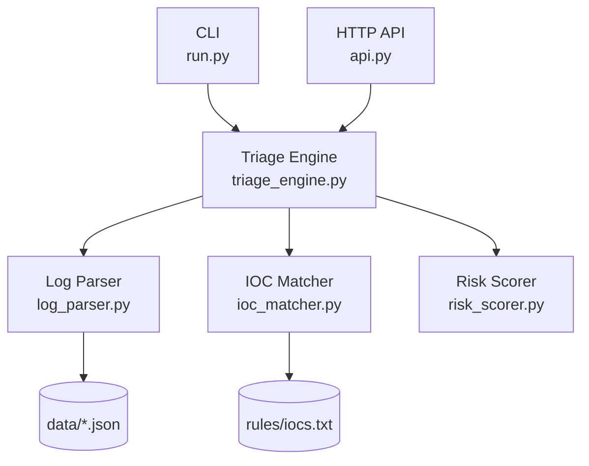

```mermaid
graph TD
    A[CLI<br>run.py] --> B[Triage Engine<br>triage_engine.py]
    C[HTTP API<br>api.py] --> B
    B --> D[Log Parser<br>log_parser.py]
    B --> E[IOC Matcher<br>ioc_matcher.py]
    B --> F[Risk Scorer<br>risk_scorer.py]
    D --> G[(data/*.json)]
    E --> H[(rules/iocs.txt)]
```